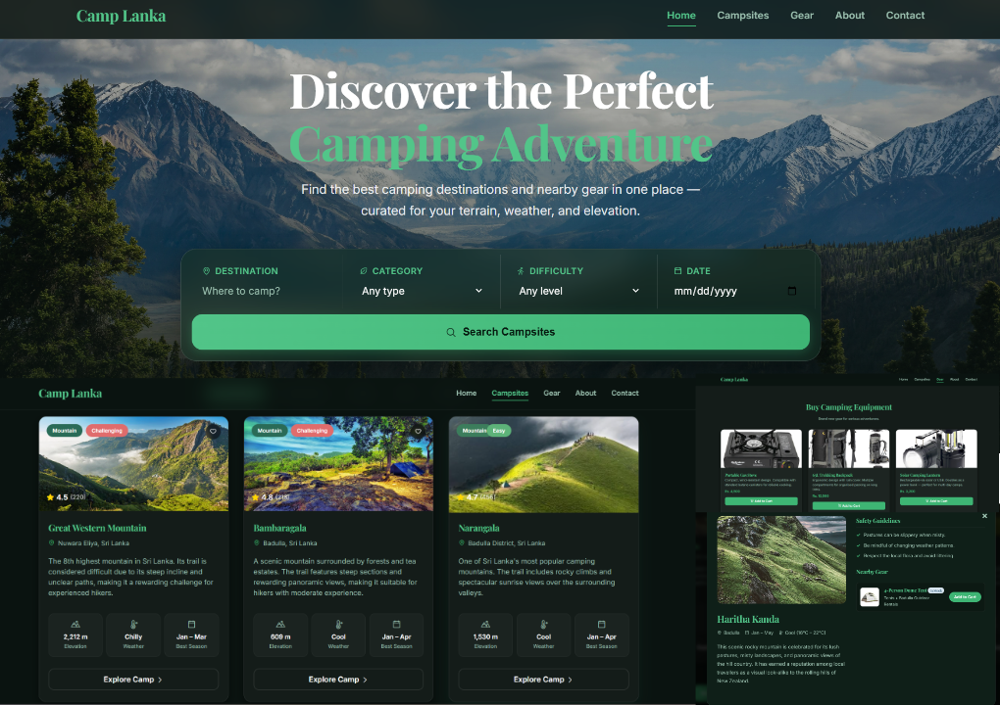

<p align="center">
  <a href="https://piyumz.github.io/camp_lanka/">
    
  </a>
</p>
🏕️ Camp Lanka – Green Adventures in Sri Lanka

Welcome to **Camp Lanka**, a comprehensive, responsive web application designed for outdoor enthusiasts looking to discover the best camping destinations, find nearby gear, and plan their perfect outdoor adventure across Sri Lanka.

---
## 🌐 Live Demo

👉 https://piyumz.github.io/camp_lanka/

---
## 🚀 Features

- **Smart Campsite Directory**: Filter and search through a curated database of campsites based on terrain (Mountain, Forest), difficulty level (Easy, Moderate, Hard), category, and dates.
- **Gear Rental & Gear Finder**: Discover and rent specialized camping gear tailored to your specific terrain, elevation, and current weather forecast.
- **Interactive UI & Experience**: A modern web interface built using premium design patterns, containing glassmorphism, responsive navigation menus, stats displays, and modern iconographies.
- **Integrated Customer Feedback**: A custom section highlighting campground reviews and testimonials from fellow adventurers.
- **Direct Inquiry Contact Form**: Plan your next trip by contacting campsite owners and coordinators directly via the built-in, responsive contact system.

---


## 🛠️ Project Structure

The project is structured as a lightweight, high-performance static website:

```text
├── css/                 # Styling files (responsive modern design systems)
├── js/                  # Interactive logic, search filters, and weather/gear systems
├── images/              # Custom icons, campsite thumbnails, and design assets
├── about.html           # Information about Camp Lanka's mission and team
├── campsites.html       # Full campsite catalog with search filters
├── contact.html         # Custom inquiry and contact form
├── gear.html            # Camping gear rental listing and categorization
├── index.html           # Main landing page featuring statistics and quick search

```

---

## 💻 Getting Started

Since **Camp Lanka** is built using vanilla HTML, CSS, and JavaScript, it has zero dependencies and can be run instantly in any modern browser.

### Prerequisites

You only need a web browser (such as Chrome, Firefox, Safari, or Edge) to run this application.

### Installation & Launch

1. **Clone the repository:**
   ```bash
   git clone https://github.com/piyumz/camp_lanka.git
   cd camp_lanka
   ```

2. **Run locally:**
   - Double-click `index.html` to open it directly in your browser.
   - Alternatively, serve the files using a local development server (e.g., Live Server extension in VS Code) for the best experience.

---

## 🎨 Technologies Used

- **HTML5**: Semantic and accessible page structuring.
- **CSS3**: Modern layouts using CSS Grid & Flexbox, custom variables, transition animations, and custom styling.
- **JavaScript (ES6+)**: Client-side filtering, interactive UI components (mobile menu, search logic), dynamic state management.
- **Phosphor Icons**: Crisp, modern icon pack for navigation and features.
- **Google Fonts (Inter & Playfair Display)**: Premium typography styling.

---

## 🤝 Contributing

Contributions to improve Camp Lanka are welcome! Feel free to fork the repository, make improvements, and submit a Pull Request.

1. Fork the Project
2. Create your Feature Branch (`git checkout -b feature/AmazingFeature`)
3. Commit your Changes (`git commit -m 'Add some AmazingFeature'`)
4. Push to the Branch (`git push origin feature/AmazingFeature`)
5. Open a Pull Request

---

## 📄 License

Distributed under the MIT License. See `LICENSE` for more information.
